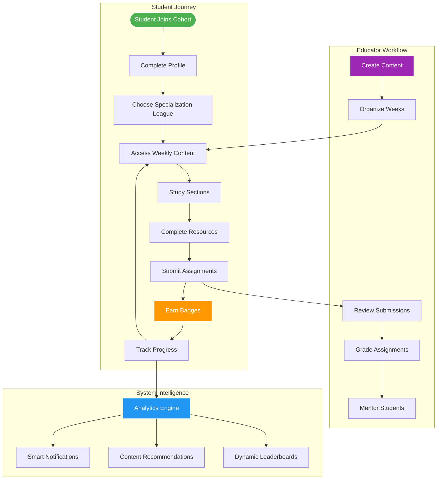
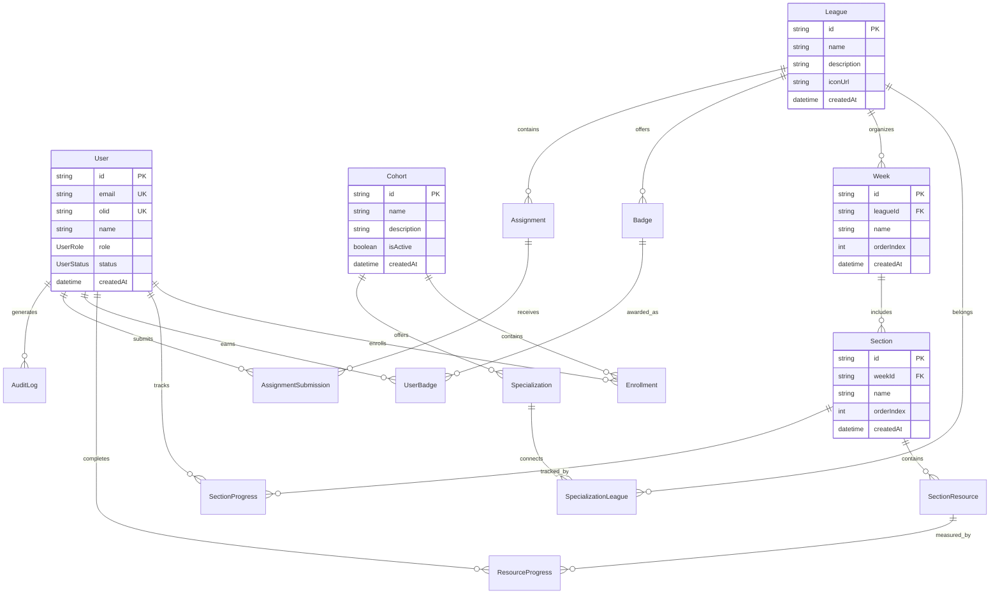
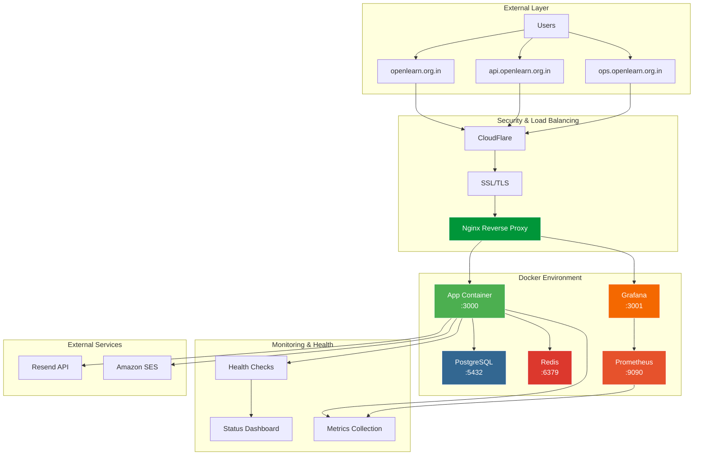
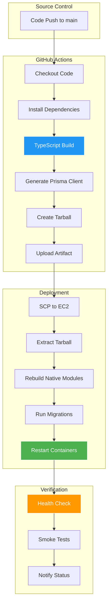

# OpenLearn Backend

<div align="center">

**A comprehensive TypeScript backend for cohort-based educational platforms**

*Modern educational platform featuring role-based learning paths, specializations, progress tracking, and gamification systems*

[](https://openlearn.org.in)
[](https://api.openlearn.org.in)
[](https://api.openlearn.org.in/status/public)
[](https://ops.openlearn.org.in)

### Technology Stack

[](https://www.typescriptlang.org/)
[](https://expressjs.com/)
[](https://www.prisma.io/)
[](https://www.postgresql.org/)
[](https://www.docker.com/)
[](https://redis.io/)
[](https://prometheus.io/)
[](https://grafana.com/)

</div>

## Live Services

- **Frontend**: [openlearn.org.in](https://openlearn.org.in) - Main platform interface
- **API**: [api.openlearn.org.in](https://api.openlearn.org.in) - REST API backend
- **Status**: [api.openlearn.org.in/status-page](https://api.openlearn.org.in/status-page) - System status dashboard
- **Monitoring**: [ops.openlearn.org.in](https://ops.openlearn.org.in) - Grafana metrics dashboard
- **Health**: [api.openlearn.org.in/health](https://api.openlearn.org.in/health) - Health check endpoint

## Documentation

### Quick Access
- **[CHANGELOG.md](./CHANGELOG.md)** - Version history and updates
- **[API Documentation](./docs/api/)** - Complete API reference and guides
- **[Architecture](./docs/architecture/)** - System design and technical architecture
- **[Development](./docs/development/)** - Development guides and tutorials
- **[Deployment](./docs/deployment/)** - Production deployment and CI/CD
- **[Monitoring](./docs/monitoring/)** - Prometheus & Grafana setup and usage

### Core API References
- **[Authentication API](./docs/api/AUTH_API_DOCUMENTATION.md)** - Complete authentication system
- **[Course Management](./docs/api/ADMIN_COURSE_API_DOCUMENTATION.md)** - Course and cohort administration
- **[Progress Tracking](./docs/api/PROGRESS_TRACKING_API_DOCUMENTATION.md)** - Learning progress and analytics
- **[Assignment System](./docs/api/ASSIGNMENT_MANAGEMENT_API_DOCUMENTATION.md)** - Assignment submission and grading

### Architecture & Operations
- **[Complete Backend Guide](./docs/architecture/OPENLEARN_BACKEND_COMPLETE.md)** - Full system overview
- **[Authentication System](./docs/architecture/AUTH_SYSTEM_COMPLETE.md)** - Security and authentication architecture
- **[Email Service](./docs/architecture/EMAIL_SERVICE_ARCHITECTURE.md)** - Email system design and flow
- **[Prometheus & Grafana Setup](./docs/monitoring/PROMETHEUS_GRAFANA_SETUP.md)** - Monitoring infrastructure guide

## Platform Features

**Educational Structure**
- Cohort-based learning with specialized tracks
- Multi-league specializations (AI/ML, Finance, Creative, etc.)
- Week-by-week structured curriculum delivery
- Section-based content organization with progress tracking

**User Management**
- Role-based access control (Pioneers, Pathfinders, Grand Pathfinders)
- Hierarchical permission system with league-specific scoping
- Social profiles and peer interaction features
- Comprehensive user progress analytics

**Content Management**
- Multi-format resources (blogs, videos, articles, external links)
- Assignment submission and evaluation system
- Personal notes and revision marking
- Badge and achievement system

**Technical Features**
- RESTful API design with comprehensive documentation
- JWT-based authentication with refresh token rotation
- Real-time health monitoring and status pages
- Email service integration (Resend, Amazon SES, Mailtrap)
- Production-grade observability with Prometheus & Grafana
- Docker containerization for consistent deployment
- Automated CI/CD with GitHub Actions

## Technical Architecture

### System Overview

```mermaid
graph TB
    subgraph "Client Layer"
        WEB[Web Dashboard]
        MOBILE[Mobile App]
        STATUS[Status Page]
    end
    
    subgraph "Load Balancing & SSL"
        NGINX[Nginx Reverse Proxy]
        SSL[SSL/TLS Termination]
    end
    
    subgraph "Application Services"
        API[Express.js API]
        AUTH[Auth Middleware]
        RBAC[RBAC System]
        METRICS_MW[Metrics Middleware]
    end
    
    subgraph "Business Logic"
        USER_SVC[User Management]
        COHORT_SVC[Cohort Service]
        CONTENT_SVC[Content Management]
        PROGRESS_SVC[Progress Tracking]
        BADGE_SVC[Badge System]
        EMAIL_SVC[Email Service]
    end
    
    subgraph "Data Layer"
        POSTGRES[(PostgreSQL 15)]
        REDIS[(Redis Cache)]
    end
    
    subgraph "Monitoring Stack"
        PROMETHEUS[Prometheus]
        GRAFANA[Grafana Dashboard]
        METRICS[/metrics Endpoint]
    end
    
    subgraph "External Services"
        RESEND[Resend API]
        AWS_SES[Amazon SES]
        MAILTRAP[Mailtrap]
    end
    
    WEB --> NGINX
    MOBILE --> NGINX
    STATUS --> NGINX
    
    NGINX --> SSL
    SSL --> API
    API --> METRICS_MW
    METRICS_MW --> AUTH
    AUTH --> RBAC
    RBAC --> USER_SVC
    RBAC --> COHORT_SVC
    RBAC --> CONTENT_SVC
    RBAC --> PROGRESS_SVC
    RBAC --> BADGE_SVC
    
    USER_SVC --> POSTGRES
    COHORT_SVC --> POSTGRES
    CONTENT_SVC --> POSTGRES
    PROGRESS_SVC --> POSTGRES
    BADGE_SVC --> POSTGRES
    EMAIL_SVC --> POSTGRES
    
    API --> REDIS
    EMAIL_SVC --> REDIS
    
    EMAIL_SVC --> RESEND
    EMAIL_SVC --> AWS_SES
    EMAIL_SVC --> MAILTRAP
    
    API --> METRICS
    PROMETHEUS --> METRICS
    GRAFANA --> PROMETHEUS
    
    style POSTGRES fill:#336791,stroke:#fff,color:#fff
    style REDIS fill:#DC382D,stroke:#fff,color:#fff
    style API fill:#000,stroke:#fff,color:#fff
    style NGINX fill:#009639,stroke:#fff,color:#fff
    style PROMETHEUS fill:#E6522C,stroke:#fff,color:#fff
    style GRAFANA fill:#F46800,stroke:#fff,color:#fff
```

### Learning Flow Architecture



### Database Schema (Only Core Models)



## Monitoring & Observability

OpenLearn includes production-grade monitoring with Prometheus and Grafana for real-time metrics, performance tracking, and system health.

### Monitoring Architecture

```mermaid
graph LR
    subgraph "Application"
        APP[Express.js API]
        METRICS_MW[Metrics Middleware]
        METRICS_EP[/metrics Endpoint]
    end
    
    subgraph "Metrics Collection"
        PROM[Prometheus<br/>:9090]
        SCRAPE[Scrapes every 15s]
    end
    
    subgraph "Visualization"
        GRAFANA[Grafana Dashboard<br/>ops.openlearn.org.in]
        DASHBOARDS[Custom Dashboards]
    end
    
    subgraph "Metrics Types"
        HTTP[HTTP Metrics]
        DB[Database Metrics]
        AUTH[Auth Metrics]
        RATE[Rate Limit Metrics]
        NODE[Node.js Metrics]
    end
    
    APP --> METRICS_MW
    METRICS_MW --> HTTP
    METRICS_MW --> DB
    METRICS_MW --> AUTH
    METRICS_MW --> RATE
    METRICS_MW --> NODE
    
    HTTP --> METRICS_EP
    DB --> METRICS_EP
    AUTH --> METRICS_EP
    RATE --> METRICS_EP
    NODE --> METRICS_EP
    
    METRICS_EP --> SCRAPE
    SCRAPE --> PROM
    PROM --> GRAFANA
    GRAFANA --> DASHBOARDS
    
    style PROM fill:#E6522C,stroke:#fff,color:#fff
    style GRAFANA fill:#F46800,stroke:#fff,color:#fff
    style APP fill:#000,stroke:#fff,color:#fff
```

### Metrics Collected

**HTTP Metrics**
- Request duration (histogram)
- Request count by method/route/status
- In-flight requests (gauge)
- Request/response sizes
- Error rates by type

**Database Metrics**
- Query execution time (histogram)
- Query count by operation/model
- Active/idle connections
- Transaction duration
- Error rates by operation

**Authentication Metrics**
- Login attempts (success/failure)
- Token validations
- JWT errors
- Active authenticated users
- Authorization failures

**Rate Limiting Metrics**
- Rate limit hits (allowed/blocked)
- Exceeded limits by endpoint type

**Node.js Metrics** (Default)
- Heap memory usage
- Event loop lag
- CPU usage
- Garbage collection stats

### Access Monitoring

- **Grafana Dashboard**: [ops.openlearn.org.in](https://ops.openlearn.org.in)
- **Prometheus UI**: Internal only (port 9090, not publicly exposed)
- **Metrics Endpoint**: `/metrics` (protected by X-API-Secret for external access)

## Deployment Architecture

### Production Infrastructure



### CI/CD Pipeline



### Deployment Features

**Build & Deployment**
- Builds on GitHub Actions (not on EC2 micro instance)
- Artifact-based deployment via SCP
- Native module rebuild for Alpine Linux compatibility (bcrypt)
- Automated database migrations with Prisma
- Zero-downtime deployment with health checks

**Container Strategy**
- Multi-stage Docker builds for optimized images
- Separate containers for app, database, cache, and monitoring
- Persistent volumes for data and metrics
- Health checks for all services
- Automatic restart policies

**Monitoring Persistence**
- Prometheus and Grafana remain running during app deployments
- Automatic reconnection after app container restarts
- No metrics data loss during deployments
- Independent update cycles for monitoring stack

## Security

### Security Stack

- **SSL/TLS**: HTTPS enforcement with CloudFlare
- **JWT Authentication**: Secure token-based auth with refresh rotation
- **RBAC**: Role-based access control with granular permissions
- **Helmet.js**: Security headers
- **Input Validation**: express-validator for all inputs
- **Rate Limiting**: Configurable limits per endpoint type
- **Audit Logging**: Complete user activity tracking
- **Secrets Management**: Environment-based configuration
- **Monitoring Auth**: X-API-Secret protection for /metrics endpoint

### User Roles & Permissions

**Role Hierarchy**
- **GRAND_PATHFINDER**: System administrator with full access
- **CHIEF_PATHFINDER**: Administrative role with management capabilities
- **PATHFINDER**: Educator/mentor with content creation rights
- **PIONEER**: Student/learner with progress tracking
- **LUMINARY**: Distinguished achievement role

**Permission Matrix**
```
Resource               | PIONEER | PATHFINDER | CHIEF_PATHFINDER | GRAND_PATHFINDER
--------------------- |---------|------------|------------------|------------------
View Content          |    ✓    |     ✓      |        ✓         |        ✓
Submit Assignments    |    ✓    |     ✓      |        ✓         |        ✓
Create Content        |    ✗    |     ✓      |        ✓         |        ✓
Manage Users          |    ✗    |     ✗      |        ✓         |        ✓
System Administration |    ✗    |     ✗      |        ✗         |        ✓
View Metrics          |    ✗    |     ✗      |        ✓         |        ✓
```

## API Overview

### Only Core Endpoints

```bash
# System Health & Status
GET  /health                         # Application health check
GET  /api/status/public              # Public system status
GET  /api/status/components          # Component status details
GET  /metrics                        # Prometheus metrics (protected)

# Authentication & User Management
POST /api/auth/register              # User registration
POST /api/auth/login                 # User authentication
POST /api/auth/refresh               # Token refresh
POST /api/auth/logout                # User logout
POST /api/auth/password-reset        # Password reset request
POST /api/auth/password-reset/verify # Verify OTP and reset password

# Learning Content Management
GET  /api/cohorts                    # List all cohorts
GET  /api/leagues                    # List specialization leagues
GET  /api/weeks                      # List weekly content
GET  /api/sections                   # List section content
GET  /api/resources                  # List learning resources

# Progress Tracking & Analytics
GET  /api/progress                   # User progress overview
POST /api/progress/section           # Mark section completed
POST /api/progress/resource          # Mark resource completed
GET  /api/analytics/counts           # Platform analytics
GET  /api/leaderboard               # Competition leaderboards

# Assignment System
GET  /api/assignments                # List assignments
POST /api/assignments/submit         # Submit assignment solution
GET  /api/assignments/:id/submissions # View submissions (educators)

# Gamification Features
GET  /api/badges                     # Available badges
GET  /api/badges/user                # User's earned badges
POST /api/social/share               # Share achievement
```

For complete API documentation, see [docs/api/](./docs/api/)

## Quick Start

### Prerequisites

- **Node.js** 18+ and npm
- **PostgreSQL** 15+ database
- **Redis** server (optional for local development)
- **Docker** & Docker Compose (recommended)

### Local Development

```bash
# Clone the repository
git clone https://github.com/openlearnnitj/openlearn-backend.git
cd openlearn-backend

# Install dependencies
npm install

# Set up environment variables
cp .env.example .env
# Edit .env with your configuration

# Start PostgreSQL and Redis with Docker
docker compose up -d postgres redis

# Run database migrations
npx prisma migrate dev

# Seed the database (optional)
npm run db:seed:dev

# Start development server
npm run dev

# Server will be running at http://localhost:3000
```

## Production Deployment

### Live Infrastructure

- **Frontend**: [openlearn.org.in](https://openlearn.org.in)
- **API**: [api.openlearn.org.in](https://api.openlearn.org.in)
- **Monitoring**: [ops.openlearn.org.in](https://ops.openlearn.org.in) - Grafana dashboards
- **Status**: [api.openlearn.org.in/status-page](https://api.openlearn.org.in/status-page)
- **Health**: [api.openlearn.org.in/health](https://api.openlearn.org.in/health)

### Deployment Process

**Automated via GitHub Actions:**
1. Push to `main` branch triggers CI/CD pipeline
2. Build runs on GitHub Actions runner
3. Creates deployment artifact (tarball)
4. Transfers artifact to EC2 via SCP
5. Extracts and rebuilds native modules (bcrypt for Alpine)
6. Runs database migrations
7. Restarts app container only
8. Prometheus/Grafana continue running
9. Health checks verify deployment

**Manual deployment (if needed):**
```bash
# SSH to EC2 server
ssh ubuntu@your-ec2-ip

# Navigate to project directory
cd /home/ubuntu/openlearn-backend

# Pull latest changes (or use artifact)
# Already done by GitHub Actions

# Run migrations
docker compose exec app npx prisma migrate deploy

# Restart app container
docker compose restart app

# Check health
curl http://localhost:3000/health
```

### Post-Deployment

```bash
# Verify all containers
docker compose ps

# Check logs
docker compose logs -f app

# View metrics
# Visit https://ops.openlearn.org.in

# Check Prometheus targets
# Internal only: curl http://localhost:9090/targets
```

## Contributing

We welcome contributions! Here's how:

1. **Fork** the repository
2. **Create** a feature branch (`git checkout -b feature/amazing-feature`)
3. **Make** your changes following our coding standards
4. **Test** thoroughly
5. **Commit** (`git commit -m 'Add amazing feature'`)
6. **Push** (`git push origin feature/amazing-feature`)
7. **Open** a Pull Request

### Coding Standards

- Follow TypeScript best practices and strict mode
- Use meaningful names
- Add JSDoc comments for complex functions
- Update documentation for API changes
- Ensure tests pass (CI/CD checks)

## Support & Resources

### Getting Help

- **Documentation**: Comprehensive guides in [`/docs`](./docs)
- **Issues**: [GitHub Issues](https://github.com/openlearnnitj/openlearn-backend/issues)

### Project Links

- **Repository**: [github.com/openlearnnitj/openlearn-backend](https://github.com/openlearnnitj/openlearn-backend)
- **Changelog**: [CHANGELOG.md](./CHANGELOG.md)
- **Architecture**: [docs/architecture/](./docs/architecture/)
- **API Docs**: [docs/api/](./docs/api/)
- **Monitoring Docs**: [docs/monitoring/](./docs/monitoring/)

---

<div align="center">

**Built with TypeScript, Express.js, Prisma, and PostgreSQL**

**Monitored with Prometheus & Grafana**

*Empowering education through technology*

**OpenLearn Platform** • **Production Ready** • **Open Source**

</div>
