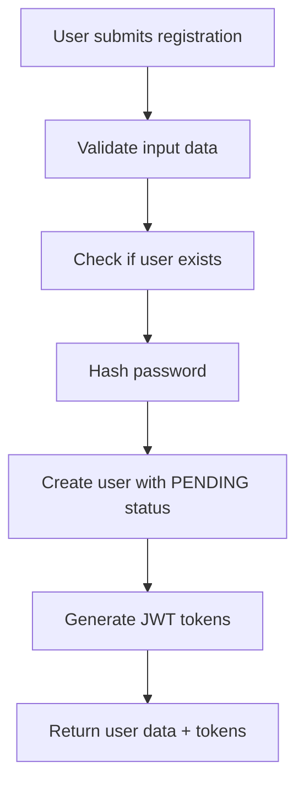
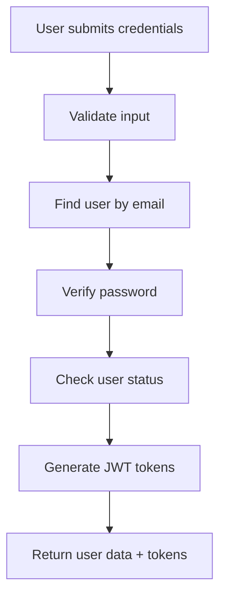
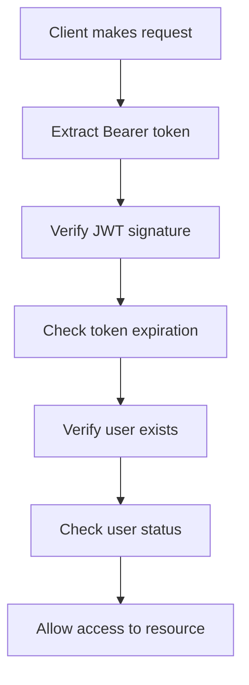

# OpenLearn Authentication API Documentation

## Base URL
```
http://localhost:3001/api/auth
```

## Authentication Overview

The OpenLearn API uses JWT (JSON Web Tokens) for authentication. The system includes:
- **Access Tokens**: Short-lived tokens (15 minutes) for API access
- **Refresh Tokens**: Long-lived tokens (7 days) for refreshing access tokens
- **Role-Based Access Control (RBAC)**: Different user roles with specific permissions

## User Roles
- **PIONEER**: Default role for students/learners (requires approval)
- **PATHFINDER**: Teachers/mentors with elevated permissions
- **CHIEF_PATHFINDER**: Senior pathfinders with additional privileges
- **GRAND_PATHFINDER**: Highest level admin role
- **LUMINARY**: Top performers

## User Status
- **PENDING**: Newly registered users awaiting approval
- **ACTIVE**: Approved users with full access
- **SUSPENDED**: Users with restricted access

---

## Endpoints

### 1. User Registration

**POST** `/signup`

Register a new user account. New users are created with `PENDING` status and require admin approval.

**Request Body:**
```json
{
  "email": "user@example.com",
  "password": "SecurePassword123!",
  "name": "John Doe"
}
```

**Password Requirements:**
- Minimum 8 characters
- At least one uppercase letter
- At least one lowercase letter
- At least one number
- At least one special character

**Response (201 Created):**
```json
{
  "success": true,
  "data": {
    "user": {
      "id": "cmbpmr5fk0001g8f6clh0zxdu",
      "email": "user@example.com",
      "name": "John Doe",
      "role": "PIONEER",
      "status": "PENDING"
    },
    "accessToken": "eyJhbGciOiJIUzI1NiIsInR5cCI6IkpXVCJ9...",
    "refreshToken": "eyJhbGciOiJIUzI1NiIsInR5cCI6IkpXVCJ9..."
  },
  "message": "User registered successfully. Account is pending approval."
}
```

**Error Responses:**
```json
// 400 Bad Request - Validation error
{
  "success": false,
  "error": "Password must be at least 8 characters long"
}

// 400 Bad Request - User exists
{
  "success": false,
  "error": "User with this email already exists"
}
```

---

### 2. User Login

**POST** `/login`

Authenticate a user and receive access tokens.

**Request Body:**
```json
{
  "email": "user@example.com",
  "password": "SecurePassword123!"
}
```

**Response (200 OK):**
```json
{
  "success": true,
  "data": {
    "user": {
      "id": "cmbpmr5fk0001g8f6clh0zxdu",
      "email": "user@example.com",
      "name": "John Doe",
      "role": "PIONEER",
      "status": "PENDING"
    },
    "accessToken": "eyJhbGciOiJIUzI1NiIsInR5cCI6IkpXVCJ9...",
    "refreshToken": "eyJhbGciOiJIUzI1NiIsInR5cCI6IkpXVCJ9..."
  },
  "message": "Login successful"
}
```

**Error Responses:**
```json
// 400 Bad Request - Invalid credentials
{
  "success": false,
  "error": "Invalid email or password"
}

// 403 Forbidden - Suspended account
{
  "success": false,
  "error": "Account is suspended. Please contact support."
}
```

---

### 3. Get User Profile

**GET** `/profile`

Get the current authenticated user's profile information.

**Headers:**
```
Authorization: Bearer <access_token>
```

**Response (200 OK):**
```json
{
  "success": true,
  "data": {
    "id": "cmbpmr5fk0001g8f6clh0zxdu",
    "email": "user@example.com",
    "name": "John Doe",
    "role": "PIONEER",
    "status": "PENDING",
    "twitterHandle": null,
    "linkedinUrl": null,
    "githubUsername": null,
    "kaggleUsername": null,
    "createdAt": "2025-06-09T21:54:48.513Z",
    "updatedAt": "2025-06-09T21:54:48.513Z",
    "approvedById": null
  },
  "message": "Profile retrieved successfully"
}
```

**Error Responses:**
```json
// 401 Unauthorized - No token
{
  "success": false,
  "error": "Access token is required"
}

// 401 Unauthorized - Invalid token
{
  "success": false,
  "error": "Invalid or expired token"
}

// 404 Not Found - User not found
{
  "success": false,
  "error": "User not found"
}
```

---

### 4. Refresh Access Token

**POST** `/refresh`

Generate a new access token using a valid refresh token.

**Request Body:**
```json
{
  "refreshToken": "eyJhbGciOiJIUzI1NiIsInR5cCI6IkpXVCJ9..."
}
```

**Response (200 OK):**
```json
{
  "success": true,
  "data": {
    "accessToken": "eyJhbGciOiJIUzI1NiIsInR5cCI6IkpXVCJ9..."
  },
  "message": "Token refreshed successfully"
}
```

**Error Responses:**
```json
// 400 Bad Request - Invalid refresh token
{
  "success": false,
  "error": "Invalid refresh token"
}

// 404 Not Found - User not found or suspended
{
  "success": false,
  "error": "User not found or suspended"
}
```

---

### 5. Logout

**POST** `/logout`

Logout the current user. Since we're using JWTs, this endpoint primarily serves as a client-side instruction to remove tokens.

**Headers:**
```
Authorization: Bearer <access_token>
```

**Response (200 OK):**
```json
{
  "success": true,
  "message": "Logout successful. Please remove tokens from client storage."
}
```

---

## Authentication Flow

### 1. Registration Flow


### 2. Login Flow


### 3. Protected Route Access


---

## Token Management

### Access Token
- **Expiration**: 15 minutes
- **Purpose**: API authentication
- **Storage**: Client memory or secure storage
- **Format**: `Bearer <token>` in Authorization header

### Refresh Token
- **Expiration**: 7 days
- **Purpose**: Generating new access tokens
- **Storage**: Secure HTTP-only cookie (recommended)
- **Usage**: Send to `/refresh` endpoint when access token expires

### Token Payload
```json
{
  "userId": "cmbpmr5fk0001g8f6clh0zxdu",
  "email": "user@example.com",
  "role": "PIONEER",
  "iat": 1749506101,
  "exp": 1749507001
}
```

---

## Error Handling

All API responses follow a consistent format:

**Success Response:**
```json
{
  "success": true,
  "data": { /* response data */ },
  "message": "Optional success message"
}
```

**Error Response:**
```json
{
  "success": false,
  "error": "Error description"
}
```

### Common HTTP Status Codes
- **200 OK**: Successful request
- **201 Created**: Resource created successfully
- **400 Bad Request**: Invalid input data
- **401 Unauthorized**: Authentication required or failed
- **403 Forbidden**: Insufficient permissions
- **404 Not Found**: Resource not found
- **500 Internal Server Error**: Server error

---

## Frontend Integration Examples

### JavaScript/TypeScript (using fetch)

```javascript
// User Registration
const signup = async (userData) => {
  const response = await fetch('http://localhost:3001/api/auth/signup', {
    method: 'POST',
    headers: {
      'Content-Type': 'application/json',
    },
    body: JSON.stringify(userData),
  });
  
  const result = await response.json();
  if (result.success) {
    // Store tokens
    localStorage.setItem('accessToken', result.data.accessToken);
    localStorage.setItem('refreshToken', result.data.refreshToken);
  }
  return result;
};

// User Login
const login = async (credentials) => {
  const response = await fetch('http://localhost:3001/api/auth/login', {
    method: 'POST',
    headers: {
      'Content-Type': 'application/json',
    },
    body: JSON.stringify(credentials),
  });
  
  const result = await response.json();
  if (result.success) {
    localStorage.setItem('accessToken', result.data.accessToken);
    localStorage.setItem('refreshToken', result.data.refreshToken);
  }
  return result;
};

// Get Profile (Protected Route)
const getProfile = async () => {
  const token = localStorage.getItem('accessToken');
  const response = await fetch('http://localhost:3001/api/auth/profile', {
    headers: {
      'Authorization': `Bearer ${token}`,
    },
  });
  
  return await response.json();
};

// Refresh Token
const refreshToken = async () => {
  const refreshToken = localStorage.getItem('refreshToken');
  const response = await fetch('http://localhost:3001/api/auth/refresh', {
    method: 'POST',
    headers: {
      'Content-Type': 'application/json',
    },
    body: JSON.stringify({ refreshToken }),
  });
  
  const result = await response.json();
  if (result.success) {
    localStorage.setItem('accessToken', result.data.accessToken);
  }
  return result;
};
```

### React Hook Example

```javascript
import { useState, useEffect } from 'react';

const useAuth = () => {
  const [user, setUser] = useState(null);
  const [loading, setLoading] = useState(true);

  useEffect(() => {
    const token = localStorage.getItem('accessToken');
    if (token) {
      getProfile()
        .then(result => {
          if (result.success) {
            setUser(result.data);
          }
        })
        .finally(() => setLoading(false));
    } else {
      setLoading(false);
    }
  }, []);

  const login = async (credentials) => {
    const result = await login(credentials);
    if (result.success) {
      setUser(result.data.user);
    }
    return result;
  };

  const logout = () => {
    localStorage.removeItem('accessToken');
    localStorage.removeItem('refreshToken');
    setUser(null);
  };

  return { user, loading, login, logout };
};
```

---

## Security Best Practices

1. **Token Storage**: Store access tokens in memory, refresh tokens in secure HTTP-only cookies
2. **HTTPS**: Always use HTTPS in production
3. **Token Expiration**: Short-lived access tokens reduce security risks
4. **Input Validation**: All inputs are validated on both client and server
5. **Password Security**: Passwords are hashed using bcrypt with salt rounds
6. **Rate Limiting**: Implement rate limiting for auth endpoints in production
7. **CORS**: Configure CORS appropriately for your frontend domain

---

## Testing with cURL

All the endpoints have been tested and are working correctly. Here are some example cURL commands:

```bash
# Health Check
curl -X GET http://localhost:3001/health

# User Signup
curl -X POST http://localhost:3001/api/auth/signup \
  -H "Content-Type: application/json" \
  -d '{"email": "test@example.com", "password": "TestPassword123!", "name": "Test User"}'

# User Login
curl -X POST http://localhost:3001/api/auth/login \
  -H "Content-Type: application/json" \
  -d '{"email": "test@example.com", "password": "TestPassword123!"}'

# Get Profile (replace TOKEN with actual access token)
curl -X GET http://localhost:3001/api/auth/profile \
  -H "Authorization: Bearer TOKEN"

# Refresh Token
curl -X POST http://localhost:3001/api/auth/refresh \
  -H "Content-Type: application/json" \
  -d '{"refreshToken": "REFRESH_TOKEN"}'

# Logout
curl -X POST http://localhost:3001/api/auth/logout \
  -H "Authorization: Bearer TOKEN"
```

---

## Next Steps

The basic authentication system is now complete and functional. Future enhancements could include:

1. **Email Verification**: Add email confirmation for new registrations
2. **Password Reset**: Implement forgot password functionality
3. **Admin Routes**: Add routes for user approval and role management
4. **Rate Limiting**: Add protection against brute force attacks
5. **Audit Logging**: Track user authentication events
6. **Two-Factor Authentication**: Add 2FA for enhanced security
7. **Social Login**: Integration with Google/GitHub OAuth

The authentication foundation is solid and ready for building the rest of the OpenLearn platform features!
